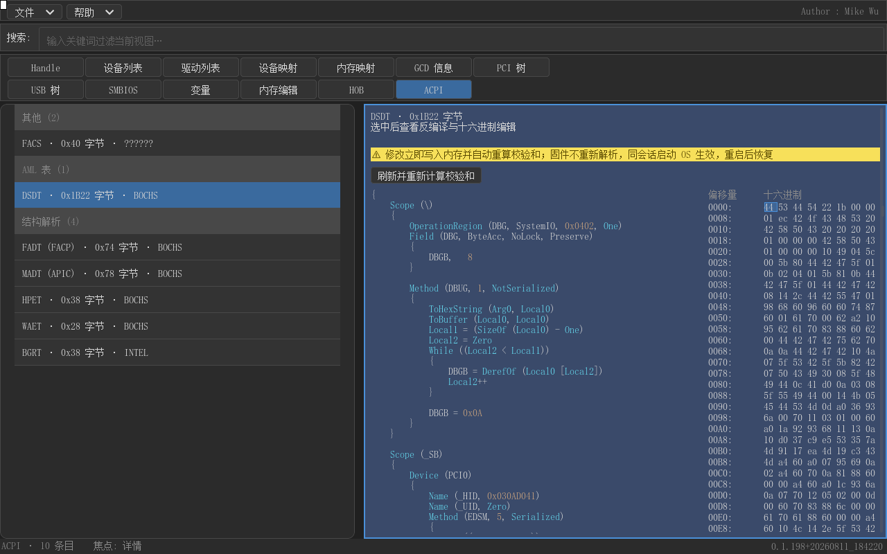

# AcpicaPkg

[](LICENSE)
[](https://github.com/acpica/acpica)
[](https://github.com/tianocore/edk2)
[](AcpicaPkg.dsc)

**ACPICA AML 反编译器 for UEFI** —— 一个把 [ACPICA](https://github.com/acpica/acpica) 的 AML 反编译引擎搬进 UEFI 固件环境的 EDK2 软件包，以 `AcpicaLib` 库形式提供唯一的公开入口 `AcpicaDisasmAmlEx()`，可把 DSDT/SSDT 等 ACPI 表反编译为 ASL 文本，并同步产出 **ASL 行 ↔ AML 字节的映射表**，支撑界面层的双向联动展示。

**[中文](README.md) | [English](#english)**

- [概述](#概述) · [功能特性](#功能特性) · [目录结构](#目录结构) · [获取源码](#获取源码) · [编译](#编译) · [接入你自己的包](#接入你自己的包) · [使用方法](#使用方法) · [移植层设计要点](#移植层设计要点) · [环境要求与已知限制](#环境要求与已知限制) · [许可证](#许可证) · [English](#english)

---

## 概述

`AcpicaPkg` 是一个标准的 EDK2 软件包：它以 git 子模块方式引入 **原版上游** ACPICA 源码（pin 在稳定 tag `20260408`，零修改），把反编译器所需的组件闭包编译成 EDK2 `BASE` 库（`AcpicaLib`），再配上一整套 UEFI 适配层（OSL、符号桩、公开 wrapper），把 ACPICA 引擎完整地落到固件环境里。整个移植不修改 edk2 源码树，也不修改 `acpica/` 内的任何文件——升级上游只需推进子模块指针。

这套移植背后有几个在固件环境里性命攸关的工程决策：**组件闭包裁剪**——只编译反编译路径真正用到的组件（utilities、parser、dispatcher 的 walk-state、namespace 子集、disassembler 全家），执行器/事件/硬件/表格/调试器/编译器一概不编译，未编译组件的符号由桩文件按语义补齐；**OSL 全量重定向**——`AcpiOs*` 全部落到 EDK2 的 `AllocatePool`/`FreePool`、`Print`、性能计数器与自旋锁上；**自驱解析树 walk**——复刻上游 `dmwalk.c` 的遍历逻辑、逐 op 调用公开 API `AcpiDmDisassembleOneOp` 渲染 ASL，并**同时记录每个 op 的输出行范围与 AML 字节区间**，让反编译结果天然携带"哪几行 ASL 来自哪段 AML"的结构化信息。这些细节下文逐一展开。

`AcpicaPkg` 是 [gudumpinfo](https://github.com/MikeWuPing/gudumpinfo)（UEFI GUI 系统信息查看器）ACPI View 功能的反编译引擎——DSDT/SSDT 的 ASL 展示、ASL↔HEX 联动编辑全部构建在本包之上。

## 功能特性

- **AML 反编译**：`AcpicaDisasmAmlEx()` 一条调用把 DSDT/SSDT 表（36 字节表头 + AML 字节流）变成 NUL 结尾的 ASL 文本；纯 parse 模式反编译（跳过 namespace 装载第二遍），未解析的外部名字按原样输出——与 `iasl` 不带 `-e` 选项的语义一致。
- **ASL ↔ AML walk 同步**：反编译的同时产出 `ACPI_AML_ROW_MAP` 映射表——每条记录给出一个 parse op 渲染出的 **ASL 行范围（RowStart/RowEnd）** 与它在表中的 **AML 偏移与长度（AmlOff/AmlLen）**，按偏移升序排列。界面层拿到映射表即可实现双向联动：点 ASL 行高亮对应 HEX 字节区间，点 HEX 字节定位到对应 ASL 行。
- **实机证明**：下图是 QEMU（OVMF）下 DSDT 反编译的实机截图——左侧 ASL 代码视图、右侧 8 字节/行 HEX 编辑器，点选 ASL 行后对应 HEX 区间以主题色高亮（gudumpinfo M8.5 双向联动 + M9 校验和自动重算的验证现场）：

  

- **零修改上游**：`acpica/` 以 git 子模块引入、pin 在 tag `20260408`（commit `232ff3f8a`），任何文件都不改动；版本升级 = `git submodule update --remote` + 重新生成 INF 源清单。
- **组件闭包裁剪**：只编译反编译路径的组件（utilities、parser、dispatcher 的 `dswstate.c`、namespace 四个文件、disassembler 全家、`ah*` 查找表），库体比全量 ACPICA 小得多；未编译组件的引用符号由 `AcpicaStubs.c` 按类别补齐（执行路径绊线、解析路径 no-op、错误/拆除路径桩、namespace 初始化真实移植）。
- **UEFI OSL 适配**：`AcpicaOsUefi.c` 把 `AcpiOs*` 系列全部映射到 EDK2 服务（`AllocatePool`/`FreePool`、`AsciiPrint` 系、`GetPerformanceCounter`、自旋锁），并针对 EDK2 PrintLib 把 `%s` 当 `CHAR16 *` 的语义做了格式串翻译（`%s → %a`），保证输出文本逐字节正确。
- **输出一致性硬约束**：自驱 walk 的输出与原 `AcpiDmDisassemble` 全程影子比对、逐字节一致后才切换为正式实现，行为等价有据可查。

## 目录结构

```
AcpicaPkg/
├── AcpicaPkg.dec                     # 包声明（公开头文件、库类）
├── AcpicaPkg.dsc                     # 包构建描述（编译反编译器库）
├── Include/Library/
│   └── AcpicaLib.h                   # 公开接口：AcpicaDisasmAmlEx + ACPI_AML_ROW_MAP
├── docs/
│   └── m9_dsdt_mount.png             # QEMU 实机验证截图（ASL↔HEX 联动）
└── Library/
    └── AcpicaDisasmLib/
        ├── AcpicaDisasmLib.inf       # 模块定义：组件闭包 + 宏注入 + 编译选项
        ├── acpica/                   # git 子模块 → 上游 ACPICA tag 20260408（原版镜像）
        ├── AcpicaOsUefi.c            # OSL：AcpiOs* → EDK2（内存/打印/计时/锁）
        ├── AcpicaStubs.c             # 未编译组件的符号桩（含 namespace 初始化真实移植）
        └── AcpicaDisasmApi.c         # wrapper：自驱 parse-tree walk + 行↔AML 映射
```

## 获取源码

ACPICA 镜像以 git 子模块形式指向上游 tag `20260408`：

```bash
git clone https://github.com/MikeWuPing/AcpicaPkg.git
cd AcpicaPkg
git submodule update --init
```

`AcpicaDisasmLib.inf`（编译单元清单）锁定在闭包内——升级子模块到新版 ACPICA tag 后，若新增/移除组件需要按「组件闭包」一节同步 INF。镜像本身保持原版，不做任何修改。

## 编译

`AcpicaPkg` 只依赖原版 edk2 的 `MdePkg`。克隆 edk2 后，把本仓库放到与 `MdePkg` 平级的目录（或把其父目录加入 `PACKAGES_PATH`），然后：

```bash
# Windows / MSVC
edksetup.bat
build -p AcpicaPkg/AcpicaPkg.dsc -a X64 -t VS2019

# Linux / GCC
source edksetup.sh
build -p AcpicaPkg/AcpicaPkg.dsc -a X64 -t GCC5
```

包的 DSC 会把反编译器库编译并链接通过（产物在 `Build/AcpicaPkg`）。`AcpicaPkg.dsc` 是**库级**构建——它验证移植层能编译、能链接，要跑起来还需要一个消费它的应用（见下节）。`DEBUG`/`RELEASE`/`NOOPT` 三种目标均支持。

## 接入你自己的包

在平台 DSC 的 `[LibraryClasses]` 里加一条库映射，外加 `CompilerIntrinsicsLib`——MSVC 在无宿主环境下会把结构体拷贝和填充循环合成对 `memcpy`/`memset` 的调用：

```ini
[LibraryClasses]
  AcpicaLib|AcpicaPkg/Library/AcpicaDisasmLib/AcpicaDisasmLib.inf
  CompilerIntrinsicsLib|MdePkg/Library/CompilerIntrinsicsLib/CompilerIntrinsicsLib.inf
```

在应用 INF 里声明库类：

```ini
[LibraryClasses]
  AcpicaLib
```

注意 `AcpicaLib` 是 `BASE` 类库——它消费 `gBS`（OSL 的内存分配走 `UefiMemoryAllocationLib`），因此由 DXE 阶段的应用/驱动来链接，`BASE` 模块（若自行链接则需自备内存分配来源）除外。

## 使用方法

公开入口只有一个，`AcpicaDisasmAmlEx()`——输入一张 AML 表镜像，输出 ASL 文本与（可选的）行↔AML 映射表：

```c
#include <Library/AcpicaLib.h>        /* AcpicaDisasmAmlEx / ACPI_AML_ROW_MAP */
#include <Library/MemoryAllocationLib.h>

EFI_STATUS
DisasmOneTable (const UINT8 *AmlTable, UINTN TableLen)
{
  EFI_STATUS        Status;
  UINT8             *AslText;
  UINTN             AslSize;
  ACPI_AML_ROW_MAP  *Map;
  UINTN             MapCount;

  Status = AcpicaDisasmAmlEx (AmlTable, TableLen,
                              &AslText, &AslSize, &Map, &MapCount);
  if (EFI_ERROR (Status)) {
    return Status;
  }

  /* AslText：NUL 结尾的 ASL 文本（FreePool 释放）。
     Map[i]：一条 parse op —— RowStart..RowEnd 是它渲染的 ASL 行范围，
     AmlOff/AmlLen 是它在表镜像中的字节区间（0 = 表头起点）。 */
  for (UINTN i = 0; i < MapCount; i++) {
    DEBUG ((DEBUG_INFO, "rows %lx-%lx -> aml 0x%lx len 0x%lx\n",
            Map[i].RowStart, Map[i].RowEnd, Map[i].AmlOff, Map[i].AmlLen));
  }

  FreePool (AslText);
  FreePool (Map);
  return EFI_SUCCESS;
}
```

映射表按 `AmlOff` 升序排列、跨度互不重叠（同偏移的 op 共享同一区间，末条延伸到表尾）——界面层可直接做"行→区间"与"偏移→行"双向查询，实现点 ASL 行高亮 HEX 字节、点 HEX 字节定位 ASL 行的联动（见 [gudumpinfo ACPI View](https://github.com/MikeWuPing/gudumpinfo) 的 M8.5 分栏视图）。

## 移植层设计要点

值得说的工程细节大多来自真机取证：

- **纯 parse 模式反编译。** 第二遍 namespace 装载（`AcpiNsOneCompleteParse`）被跳过，`AcpiNsSearchAndEnter` 在解析期恒返回 `AE_NOT_FOUND`——名字按源文件原样输出（iasl 无 `-e` 语义），这正是"反编译给用户看"需要的形态。
- **自驱 walk 输出与官方一致。** wrapper 复刻 `dmwalk.c` 的 `AcpiDmDescendingOp`/`AcpiDmAscendingOp` 遍历（depth-first + 换行/缩进/括号规则），逐 op 调公开 API `AcpiDmDisassembleOneOp` 渲染；开发期与原 `AcpiDmDisassemble` 输出做逐字节影子比对，一致后才切换。
- **行号 ↔ AML 映射在渲染时同步记录。** 每个产出文本的 op 记录其输出行范围与 AML 跨度，不依赖事后文本解析——因此映射天然精确到行，删除诊断行后 UI 侧另行补偿行号。
- **OSL 的 `%s` 陷阱。** EDK2 PrintLib 把格式串里的 `%s` 解释为 `CHAR16 *`，而 ACPICA 的 `%s` 是 `char *`——OSL 里对格式串做 `%s → %a` 翻译，否则输出文本会逐字符损坏（`Field` 变 `Fed`）。
- **组件闭包是收益也是纪律。** 不编译的组件（executer/events/hardware/tables/debugger/compiler）在闭包内无定义，`AcpicaStubs.c` 按"执行路径绊线 / 解析路径 no-op / 错误与拆除路径桩 / namespace 初始化真实移植"四类补齐引用符号——任何闭包遗漏都会在链接期暴露，不会静默吞错。
- **反编译对表内容宽容。** 解析失败（表损坏）时返回错误码并释放全部中间态，wrapper 侧按失败处理，不会留下半成品文本。

## 环境要求与已知限制

**环境要求：** EDK2（仅 `MdePkg`）、X64 架构、DXE 阶段、MSVC（VS2019/2022）或 GCC 工具链。

**已知限制：**
- 仅 X64；纯反编译（disassembler）用途——执行器、事件、硬件、表格管理、调试器、编译器组件未编译，`AcpicaStubs.c` 对执行路径符号提供的是"必须不会触发的绊线"，不可用于 AML 解释执行。
- 反编译语义为"无 `-e` 外部符号解析"：未解析的名字按原样输出，适合查看/编辑，不适合直接回编译为可装载镜像（回编译请用 iasl 配合外部符号表）。
- 输入必须是完整的 ACPI 表镜像（36 字节表头 + AML 字节流）；小于表头的输入直接拒绝。
- 文本与映射输出走 `AllocatePool`，由调用方负责 `FreePool`。

## 许可证

`AcpicaPkg` 的移植层（dec/dsc/INF/OSL/桩/wrapper/文档）以 **MIT License** 发布——见 [LICENSE](LICENSE)。随包携带的 ACPICA 镜像以 git 子模块方式引入，保留上游自身的双许可（GPL v2 / BSD 3-Clause，见子模块内 LICENSE 文件）。

---

# English

> [中文](README.md) · **English**

- [Overview](#overview) · [Features](#features) · [Repository layout](#repository-layout) · [Getting the sources](#getting-the-sources) · [Build](#build) · [Integrate into your package](#integrate-into-your-package) · [Usage](#usage) · [Port design notes](#port-design-notes) · [Requirements & limitations](#requirements--limitations) · [License](#license)

## Overview

`AcpicaPkg` is a standard EDK2 package that brings the [ACPICA](https://github.com/acpica/acpica) AML disassembler engine into the UEFI firmware environment. The pristine upstream ACPICA sources are vendored as a git submodule (pinned to stable tag `20260408`, never modified) and compiled into an EDK2 `BASE` library (`AcpicaLib`) behind a single public entry point, `AcpicaDisasmAmlEx()`, which turns a DSDT/SSDT table image into ASL text **and** a row-to-AML mapping table that links each rendered ASL line to the AML bytes it came from.

The port is built on a few deliberate engineering decisions: a **component closure** — only the components the disassembler actually needs are compiled (utilities, parser, the dispatcher's walk-state machine, a namespace subset, the disassembler family), everything else is stubbed by semantics; a **full OSL redirect** — every `AcpiOs*` lands on EDK2 services (`AllocatePool`/`FreePool`, `Print`, performance counters, spin locks); and a **self-driven parse-tree walk** that replicates the upstream `dmwalk.c` traversal, renders each op via the public `AcpiDmDisassembleOneOp`, and records each op's output row range alongside its AML byte span — so the disassembly output natively carries structured "which ASL lines came from which AML bytes" information.

`AcpicaPkg` powers the ACPI View of [gudumpinfo](https://github.com/MikeWuPing/gudumpinfo) (a UEFI GUI system-information viewer): the ASL rendering of DSDT/SSDT tables and the ASL↔HEX linked editing all build on this package.

## Features

- **AML disassembly**: one `AcpicaDisasmAmlEx()` call turns a DSDT/SSDT table image (36-byte header + AML byte stream) into NUL-terminated ASL text; pure parse-mode disassembly (namespace load pass skipped) emits unresolved names as written — matching `iasl` without `-e`.
- **ASL ↔ AML walk synchronization**: the call also produces an `ACPI_AML_ROW_MAP` table — one record per parse op, mapping its **ASL row range (RowStart/RowEnd)** to its **AML offset/length (AmlOff/AmlLen)** in the table image, sorted by offset. A UI layer can use it for bidirectional linking: click an ASL row to highlight the corresponding HEX bytes; click a HEX byte to locate the ASL row.
- **Proof from real hardware**: the screenshot below is a live QEMU (OVMF) run of gudumpinfo disassembling the DSDT — the ASL code view on the left, an 8-byte-per-row HEX editor on the right, with the HEX range highlighted in the theme accent color after selecting an ASL row:

  

- **Pristine upstream**: `acpica/` is a git submodule pinned to tag `20260408` (commit `232ff3f8a`); no file inside it is ever modified. Upgrading = moving the submodule pointer.
- **Component closure**: only disassembler-path components are compiled (utilities, parser, `dswstate.c`, four namespace files, the whole disassembler family, `ah*` lookup tables) — a much smaller library than a full ACPICA build; symbols referenced from non-compiled components are provided by `AcpicaStubs.c` in four semantic categories.
- **UEFI OSL adaptation**: `AcpicaOsUefi.c` maps every `AcpiOs*` to EDK2 services (`AllocatePool`/`FreePool`, `AsciiPrint` family, `GetPerformanceCounter`, spin locks), including a format-string translation (`%s → %a`) that works around EDK2 PrintLib's `CHAR16 *` interpretation of `%s` — without it the output text would be corrupted.
- **Output-consistency hard constraint**: the self-driven walk's output was shadow-compared against the stock `AcpiDmDisassemble` byte-for-byte before switching to it as the production implementation.

## Repository layout

```
AcpicaPkg/
├── AcpicaPkg.dec                     # package declaration (public headers, library class)
├── AcpicaPkg.dsc                     # package build description (builds the disassembler lib)
├── Include/Library/
│   └── AcpicaLib.h                   # public interface: AcpicaDisasmAmlEx + ACPI_AML_ROW_MAP
├── docs/
│   └── m9_dsdt_mount.png             # live QEMU screenshot (ASL↔HEX linking)
└── Library/
    └── AcpicaDisasmLib/
        ├── AcpicaDisasmLib.inf       # module definition: component closure + defines + flags
        ├── acpica/                   # git submodule → upstream ACPICA tag 20260408 (pristine)
        ├── AcpicaOsUefi.c            # OSL: AcpiOs* → EDK2 (memory/print/timer/locks)
        ├── AcpicaStubs.c             # stubs for non-compiled components (+ real namespace init ports)
        └── AcpicaDisasmApi.c         # wrapper: self-driven parse-tree walk + row↔AML map
```

## Getting the sources

The ACPICA mirror is a git submodule pointing at upstream tag `20260408`:

```bash
git clone https://github.com/MikeWuPing/AcpicaPkg.git
cd AcpicaPkg
git submodule update --init
```

`AcpicaDisasmLib.inf` (the compiled-unit list) is locked to the closure — when you bump the submodule to a newer ACPICA tag, sync the INF if components were added or removed. The mirror itself is never edited.

## Build

`AcpicaPkg` builds against a stock edk2 tree (`MdePkg` only). Clone edk2, place this repo as a sibling of `MdePkg` (or add its parent to `PACKAGES_PATH`), then:

```bash
# Windows / MSVC
edksetup.bat
build -p AcpicaPkg/AcpicaPkg.dsc -a X64 -t VS2019

# Linux / GCC
source edksetup.sh
build -p AcpicaPkg/AcpicaPkg.dsc -a X64 -t GCC5
```

The package DSC compiles and links the disassembler library (output under `Build/AcpicaPkg`). Note that `AcpicaPkg.dsc` is a *library* build — it validates that the port compiles and links; a runnable image needs a consuming application (see below). Both `DEBUG`/`RELEASE`/`NOOPT` targets are supported.

## Integrate into your package

Add one library mapping to your platform DSC's `[LibraryClasses]` — plus `CompilerIntrinsicsLib`, because MSVC synthesizes `memcpy`/`memset` calls in freestanding builds:

```ini
[LibraryClasses]
  AcpicaLib|AcpicaPkg/Library/AcpicaDisasmLib/AcpicaDisasmLib.inf
  CompilerIntrinsicsLib|MdePkg/Library/CompilerIntrinsicsLib/CompilerIntrinsicsLib.inf
```

Declare the library class in your application's INF:

```ini
[LibraryClasses]
  AcpicaLib
```

`AcpicaLib` is a `BASE`-class library (its OSL consumes `gBS` via `UefiMemoryAllocationLib`), so consume it from DXE-phase applications/drivers.

## Usage

A single public entry point, `AcpicaDisasmAmlEx()` — feed it an AML table image, get back ASL text and (optionally) the row↔AML mapping table:

```c
#include <Library/AcpicaLib.h>        /* AcpicaDisasmAmlEx / ACPI_AML_ROW_MAP */
#include <Library/MemoryAllocationLib.h>

EFI_STATUS
DisasmOneTable (const UINT8 *AmlTable, UINTN TableLen)
{
  EFI_STATUS        Status;
  UINT8             *AslText;
  UINTN             AslSize;
  ACPI_AML_ROW_MAP  *Map;
  UINTN             MapCount;

  Status = AcpicaDisasmAmlEx (AmlTable, TableLen,
                              &AslText, &AslSize, &Map, &MapCount);
  if (EFI_ERROR (Status)) {
    return Status;
  }

  /* AslText: NUL-terminated ASL text (free with FreePool).
     Map[i]: one parse op — RowStart..RowEnd is the ASL row range it
     rendered, AmlOff/AmlLen its byte span in the table image
     (0 = table start). */
  for (UINTN i = 0; i < MapCount; i++) {
    DEBUG ((DEBUG_INFO, "rows %lx-%lx -> aml 0x%lx len 0x%lx\n",
            Map[i].RowStart, Map[i].RowEnd, Map[i].AmlOff, Map[i].AmlLen));
  }

  FreePool (AslText);
  FreePool (Map);
  return EFI_SUCCESS;
}
```

The mapping table is sorted by `AmlOff` with non-overlapping spans (ops sharing one offset get the same span; the last entry extends to the end of the table) — a UI can do direct "row → range" and "offset → row" lookups for bidirectional linking, as implemented in gudumpinfo's M8.5 split view.

## Port design notes

The interesting engineering is in the details, most of which took real debugging to get right:

- **Pure parse-mode disassembly.** The second (namespace load) pass is skipped and `AcpiNsSearchAndEnter` always resolves nothing during parsing, so names are emitted as written (iasl-without-`-e` semantics) — exactly the shape you want for viewing/editing.
- **Self-driven walk, output identical to upstream.** The wrapper replicates the `dmwalk.c` `AcpiDmDescendingOp`/`AcpiDmAscendingOp` traversal (depth-first with newline/indent/paren logic) and renders each op via the public `AcpiDmDisassembleOneOp`; the output was shadow-compared byte-for-byte against the stock `AcpiDmDisassemble` before switching.
- **Row↔AML mapping recorded during rendering.** Each op that produces text records its output row range and AML span as it renders — no post-hoc text parsing, so the mapping is exact per line (the UI compensates row numbers when diagnostic lines are filtered).
- **The OSL `%s` trap.** EDK2 PrintLib interprets `%s` as `CHAR16 *` while ACPICA's `%s` is `char *`; the OSL translates `%s → %a` in format strings, otherwise the output text is corrupted character-by-character (`Field` becomes `Fed`).
- **The closure is both a win and a discipline.** Non-compiled components (executer/events/hardware/tables/debugger/compiler) have no definitions inside the closure; `AcpicaStubs.c` supplies every referenced symbol in four semantic categories (execution-path tripwires / parse-path no-ops / error-and-teardown stubs / real namespace-init ports). Any closure gap surfaces at link time — never silently.
- **Disassembly is tolerant of table content.** Parse failures (corrupt tables) return an error code and release all intermediate state; the wrapper never leaves half-baked text behind.

## Requirements & limitations

**Requirements:** EDK2 (`MdePkg` only), X64 architecture, DXE phase, MSVC (VS2019/2022) or GCC toolchain.

**Known limitations:**
- X64 only; disassembly-only — the executer, events, hardware, tables, debugger and compiler components are not compiled; the execution-path symbols in `AcpicaStubs.c` are tripwires that must never fire, so the library cannot interpret/execute AML.
- Disassembly semantics are "no `-e` external resolution": unresolved names are emitted as written — good for viewing/editing, not for recompiling into a loadable image (use `iasl` with an external-symbol table for that).
- Input must be a complete ACPI table image (36-byte header + AML byte stream); shorter inputs are rejected up front.
- Text and mapping output are allocated with `AllocatePool`; the caller frees them with `FreePool`.

## License

The port layer of `AcpicaPkg` (dec/dsc/INF/OSL/stubs/wrapper/docs) is released under the **MIT License** — see [LICENSE](LICENSE). The bundled ACPICA mirror is a git submodule that retains its upstream dual license (GPL v2 / BSD 3-Clause, see the LICENSE file inside the submodule).
